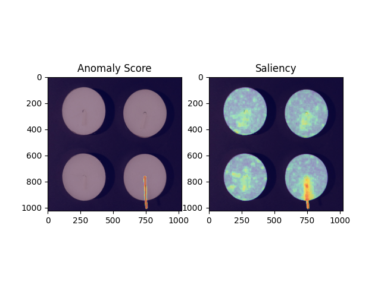
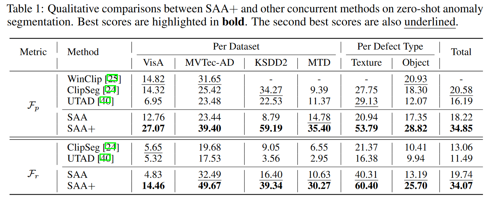
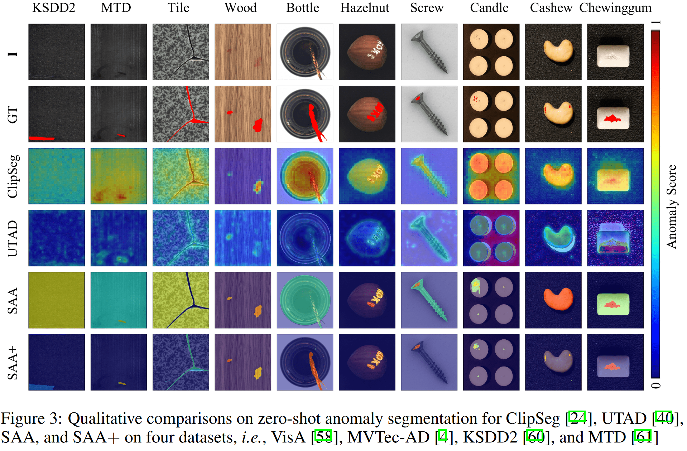

# Segment Any Anomaly
[](https://colab.research.google.com/drive/12Sh0j92YYmTa0oIuSEWWpPBCpIwCSVhz?usp=sharing)
[](https://huggingface.co/spaces/Caoyunkang/Segment-Any-Anomaly)

This repository contains the official implementation of [Segment Any Anomaly without Training via Hybrid Prompt Regularization, SAA+](http://arxiv.org/abs/2305.10724).

SAA+ aims to segment any anomaly without the need for training. We achieve this by adapting existing foundation models, 
namely [Grounding DINO](https://github.com/IDEA-Research/GroundingDINO) and 
[Segment Anything](https://github.com/facebookresearch/segment-anything), with hybrid prompt regularization.

## :fire:What's New

- We have added a [Huggingface demo](https://huggingface.co/spaces/Caoyunkang/Segment-Any-Anomaly). Enjoy it~
- We have updated the [colab demo](https://colab.research.google.com/drive/12Sh0j92YYmTa0oIuSEWWpPBCpIwCSVhz?usp=sharing). Enjoy it~
- We have updated this repository for SAA+.
- We have published [Segment Any Anomaly without Training via Hybrid Prompt Regularization, SAA+](http://arxiv.org/abs/2305.10724).


## :gem:Framework
We found that a simple assembly of foundation models suffers from severe language ambiguity. 
Therefore, we introduce hybrid prompts derived from domain expert knowledge and target image context to alleviate the language ambiguity. 
The framework is illustrated below:


## Quick Start

### :bank:Dataset Preparation

We evaluate SAA+ on four public datasets: MVTec-AD, VisA, KSDD2, and MTD. 
Additionally, SAA+ was a winning team in the [VAND workshop](https://sites.google.com/view/vand-cvpr23/challenge), 
which offers a specified dataset, VisA-Challenge. To prepare the datasets, please follow the instructions below:

By default, we save the data in the `../datasets` directory.

```bash
cd $ProjectRoot # e.g., /home/SAA
cd ..
mkdir datasets
cd datasets
```

Then, follow the corresponding instructions to prepare individual datasets:

- [MVTec-AD](https://www.mvtec.com/company/research/datasets/mvtec-ad/)
- [VisA-Public](https://github.com/search?q=spot+the+difference&type=repositories)
- [VisA-Challenge](https://codalab.lisn.upsaclay.fr/competitions/12499)
- [KSDD2](https://www.vicos.si/resources/kolektorsdd2/)
- [MTD](https://github.com/abin24/Magnetic-tile-defect-datasets.)

### :hammer:Environment Setup
You can use our script for one-click setup of the environment and downloading the checkpoints.

```bash
cd $ProjectRoot
bash install.sh
```

### :page_facing_up:Repeat the public results

**MVTec-AD**

```bash
python run_MVTec.py
```

**VisA-Public**

```bash
python run_VisA_public.py
```

**VisA-Challenge**

```bash
python run_VAND_workshop.py
```

The submission files can be found in `./result_VAND_workshop/visa_challenge-k-0/0shot`.

**KSDD2**

```bash
python run_KSDD2.py
```

**MTD**

```bash
python run_MTD.py
```

### :page_facing_up:Demo Results

Run following command for demo results

```bash
python demo.py
```



## :dart:Performance




## :hammer: Todo List

We have planned the following features to be added in the near future:

- [x] Update repository for SAA+
- [X] Detail the zero-shot anomaly detection framework.
- [x] Evaluate on other image anomaly detection datasets.
- [x] Add UI for easy evaluation.
- [x] Update Colab demo.
- [x] HuggingFace demo.

## 💘 Acknowledgements
Our work is largely inspired by the following projects. Thanks for their admiring contribution.

- [WinClip](https://github.com/caoyunkang/WinClip)
- [segment-anything](https://github.com/facebookresearch/segment-anything)
- [GroundingDINO](https://github.com/IDEA-Research/GroundingDINO)
- [Grounded Segment Anything](https://github.com/IDEA-Research/Grounded-Segment-Anything)


## Stargazers over time

[](https://starchart.cc/caoyunkang/Segment-Any-Anomaly)


## Citation

If you find this project helpful for your research, please consider citing the following BibTeX entry.

```BibTex

@article{cao_segment_2023,
	title = {Segment Any Anomaly without Training via Hybrid Prompt Regularization},
	url = {http://arxiv.org/abs/2305.10724},
	number = {{arXiv}:2305.10724},
	publisher = {{arXiv}},
	author = {Cao, Yunkang and Xu, Xiaohao and Sun, Chen and Cheng, Yuqi and Du, Zongwei and Gao, Liang and Shen, Weiming},
	urldate = {2023-05-19},
	date = {2023-05-18},
	langid = {english},
	eprinttype = {arxiv},
	eprint = {2305.10724 [cs]},
	keywords = {Computer Science - Computer Vision and Pattern Recognition, Computer Science - Artificial Intelligence},
}

@article{kirillov2023segany,
  title={Segment Anything}, 
  author={Kirillov, Alexander and Mintun, Eric and Ravi, Nikhila and Mao, Hanzi and Rolland, Chloe and Gustafson, Laura and Xiao, Tete and Whitehead, Spencer and Berg, Alexander C. and Lo, Wan-Yen and Doll{\'a}r, Piotr and Girshick, Ross},
  journal={arXiv:2304.02643},
  year={2023}
}

@inproceedings{ShilongLiu2023GroundingDM,
  title={Grounding DINO: Marrying DINO with Grounded Pre-Training for Open-Set Object Detection},
  author={Shilong Liu and Zhaoyang Zeng and Tianhe Ren and Feng Li and Hao Zhang and Jie Yang and Chunyuan Li and Jianwei Yang and Hang Su and Jun Zhu and Lei Zhang},
  year={2023}
}
```
